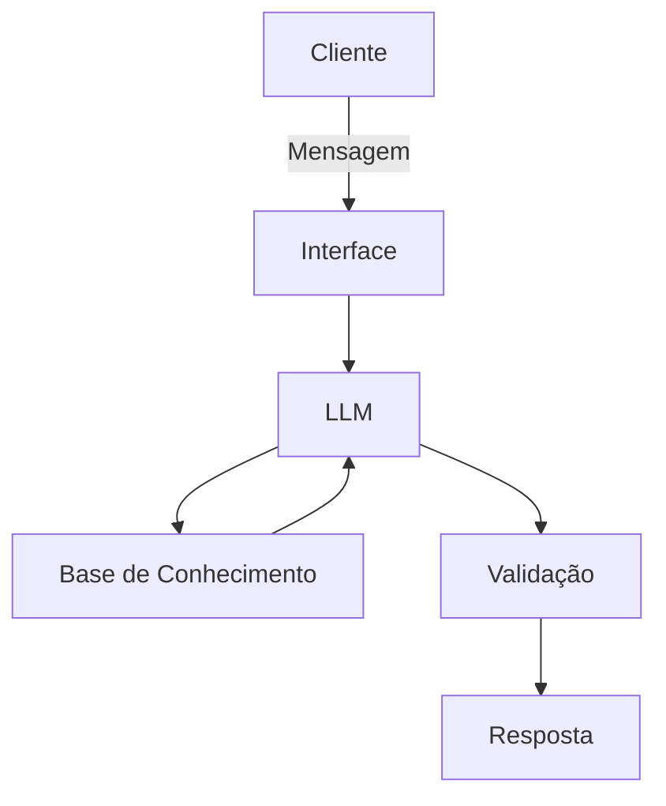

# Documentação do Agente

## Caso de Uso

### Problema
> Qual problema financeiro seu agente resolve?

O Agente Financeiro Consultivo é uma solução baseada em Inteligência Artificial desenvolvida para auxiliar pessoas na compreensão de sua situação financeira por meio de análises, comparações e informações educativas.

O objetivo do agente é fornecer contexto para apoiar o usuário em suas decisões, sem indicar qual decisão deve ser tomada.

O sistema atua como um consultor informativo, ajudando o usuário a interpretar seus dados financeiros e a identificar padrões de comportamento.

### Solução
> Como o agente resolve esse problema de forma proativa?

Analisar despesas:
- comparar gastos entre meses.
- Identificar aumento ou redução de despesas.
- Mostrar categorias com maior impacto no orçamento.
-Apresentar a evolução das despesas ao longo do tempo.
################################################################

Analisar receitas:
- Comparar evolução da renda.
- Identificar fontes de receita.
- Demonstrar variações mensais.
- Apontar períodos de maior ou menor entrada de recursos.
################################################################

Analisar patrimônio: 
- Saldo em contas.
- Investimentos cadastrados.
- Bens informados.
- Dívidas registradas.
- Evolução do patrimônio.
################################################################

Acompanhar objetivos financeiros:
- Compra de imóvel.
- Compra de veículo.
- Formação de reserva financeira.
- Planejamento para aposentadoria.
- Viagens.
- Estudos.
################################################################

Identificar tendências: 
- Crescimento contínuo das despesas.
- Redução da capacidade de poupança.
- Alterações no padrão de consumo.
- Aumento do comprometimento da renda.

### Público-Alvo
> Quem vai usar esse agente?

Pessoas que necessitam planejar melhor sua saúde financeira por meio de análises, comparações e informações educativas.

## Persona e Tom de Voz

### Nome do Agente
[Nome escolhido]

### Personalidade
> Como o agente se comporta? (ex: consultivo, direto, educativo)

[Sua descrição aqui]

### Tom de Comunicação
> Formal, informal, técnico, acessível?

[Sua descrição aqui]

### Exemplos de Linguagem
- Saudação: [ex: "Olá! Como posso ajudar com suas finanças hoje?"]
- Confirmação: [ex: "Entendi! Deixa eu verificar isso para você."]
- Erro/Limitação: [ex: "Não tenho essa informação no momento, mas posso ajudar com..."]

---

## Arquitetura

### Diagrama

### Componentes

| Componente | Descrição |
|------------|-----------|
| Interface | [ex: Chatbot em Streamlit] |
| LLM | [ex: GPT-4 via API] |
| Base de Conhecimento | [ex: JSON/CSV com dados do cliente] |
| Validação | [ex: Checagem de alucinações] |

---

## Segurança e Anti-Alucinação

### Estratégias Adotadas

- [ ] [ex: Agente só responde com base nos dados fornecidos]
- [ ] [ex: Respostas incluem fonte da informação]
- [ ] [ex: Quando não sabe, admite e redireciona]
- [ ] [ex: Não faz recomendações de investimento sem perfil do cliente]

### Limitações Declaradas
> O que o agente NÃO faz?

[Liste aqui as limitações explícitas do agente]
