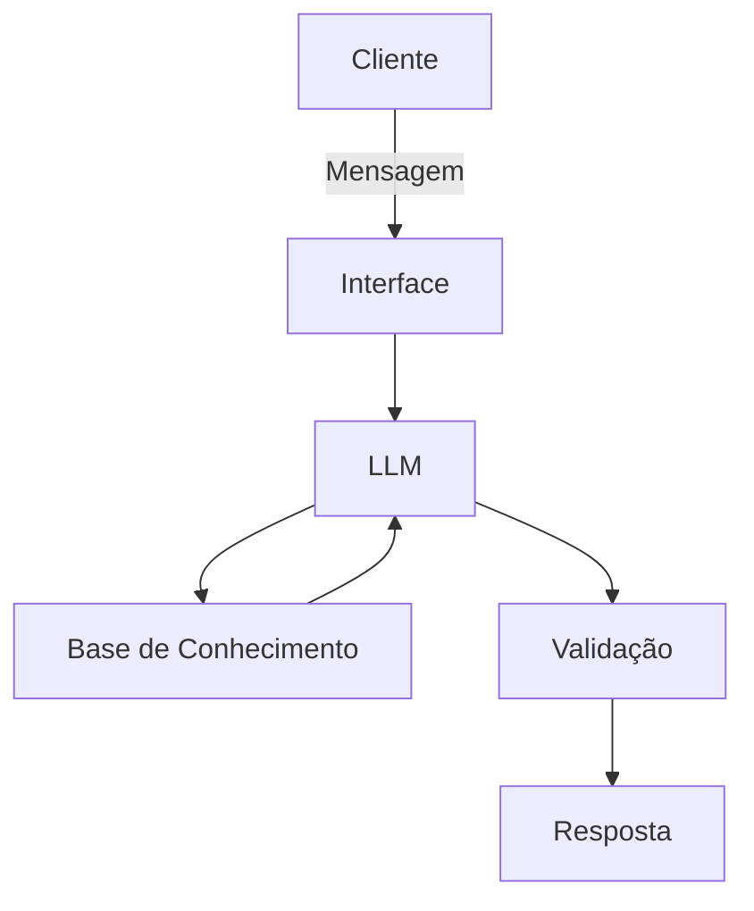

# Documentação do Agente

## Caso de Uso

### Problema
> Qual problema financeiro seu agente resolve?

Muitas pessoas têm dificuldade para compreender e organizar sua própria vida financeira.

Mesmo possuindo renda, o usuário pode não saber:

- para onde seu dinheiro está indo;
- quanto realmente consegue economizar;
- quais despesas estão comprometendo seu orçamento;
- quais riscos existem ao assumir uma nova dívida;
- como priorizar seus objetivos financeiros;
- quais alternativas podem ser consideradas antes de tomar uma decisão.

As ferramentas financeiras tradicionais geralmente apresentam dados, gráficos e números, mas nem sempre ajudam o usuário a interpretar essas informações de forma simples e personalizada.
O problema é a falta de um assistente capaz de conversar com o usuário, compreender seu contexto financeiro e oferecer dicas e informações relevantes para ajudá-lo a refletir sobre suas próprias decisões.

**O agente não deve decidir pelo usuário. Seu papel é fornecer informações e ampliar a capacidade de análise da pessoa.** 

### Solução
> Como o agente resolve esse problema de forma proativa?
> 
Criar um Agente Financeiro Consultivo baseado em Inteligência Artificial capaz de analisar informações fornecidas pelo usuário e oferecer:

- dicas de organização financeira;
- explicações sobre conceitos financeiros;
- identificação de padrões de gastos;
- alertas sobre possíveis pontos de atenção;
- comparação entre cenários;
- apresentação de vantagens e desvantagens;
- identificação de riscos;
- sugestões de perguntas que o usuário deveria considerar;
- auxílio no planejamento de objetivos financeiros.

O agente deverá apresentar as informações de forma clara, simples e personalizada.

Sua função será, ajudar o usuário a compreender melhor sua situação financeira para que ele possa tomar suas próprias decisões.

**O agente não deverá emitir ordens ou determinar o que o usuário deve fazer.**

Exemplo

Usuário:

"Estou pensando em financiar um carro."

Agente:

"Antes de decidir, vale analisar alguns pontos: o valor da parcela em relação à sua renda, o custo total do financiamento, seguro, manutenção, combustível e o impacto dessa nova despesa no seu orçamento. Também pode ser interessante comparar diferentes cenários de entrada e prazo. Se quiser, posso ajudar você a organizar essa análise."

**O agente apresenta informações e possibilidades, mas a decisão continua sendo do usuário.**

Público-Alvo

O agente será destinado principalmente a pessoas que desejam melhorar sua organização e consciência financeira, mas que não possuem conhecimento técnico avançado sobre finanças.
### Público-Alvo
> Quem vai usar esse agente?

Pessoas que necessitam planejar melhor sua saúde financeira por meio de análises, comparações e informações educativas.

## Persona e Tom de Voz

### Nome do Agente
FinIA () 
### Personalidade
> Como o agente se comporta? (ex: consultivo, direto, educativo)

[Sua descrição aqui]

### Tom de Comunicação
> Formal, informal, técnico, acessível?

[Sua descrição aqui]

### Exemplos de Linguagem
- Saudação: [ex: "Olá! Como posso ajudar com suas finanças hoje?"]
- Confirmação: [ex: "Entendi! Deixa eu verificar isso para você."]
- Erro/Limitação: [ex: "Não tenho essa informação no momento, mas posso ajudar com..."]

---

## Arquitetura

### Diagrama

### Componentes

| Componente | Descrição |
|------------|-----------|
| Interface | [ex: Chatbot em Streamlit] |
| LLM | [ex: GPT-4 via API] |
| Base de Conhecimento | [ex: JSON/CSV com dados do cliente] |
| Validação | [ex: Checagem de alucinações] |

---

## Segurança e Anti-Alucinação

### Estratégias Adotadas

- [ ] [ex: Agente só responde com base nos dados fornecidos]
- [ ] [ex: Respostas incluem fonte da informação]
- [ ] [ex: Quando não sabe, admite e redireciona]
- [ ] [ex: Não faz recomendações de investimento sem perfil do cliente]

### Limitações Declaradas
> O que o agente NÃO faz?

[Liste aqui as limitações explícitas do agente]
